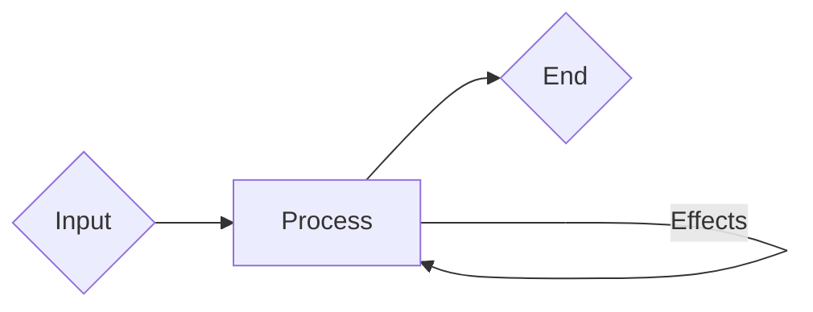

# State & Behaviors

For games such as turn-based RPGs, it's particularly important for state and behaviors to be sensibly manageable; it is, after all, core to the mechanics that are present in this genre. State is present in the data associated with in-game characters and events, and you'd want to make sure that in-game systems can respond to that many variables present.

State management itself is already a solved problem through the use of [Resource]s and state machines — as in the [state pattern](https://gameprogrammingpatterns.com/state.html#the-state-pattern) and not just some glorified `enum`. Persisting these to disk should in theory be as easy as simply using the save system developed at `~/libraries/db` and implemented in `~/resources/saves`

The save system isn't really anything special, I might consider open sourcing it once traits are added to GDScript. The real meat of this post's about behavior trees.

## Mind Your Behaviors

Behavior trees, a simple and ingenious way of implementing the decision making process of AI agents; it's a scalable algorithm that lends well to composition over inheritance. It describes decision trees with the unit of work being behaviors rather than decisions.

You give the tree input in the form of blackboards where for simplification purposes is the parlance for what is essentially a key value data store. It has no output in the traditional sense — you create side effects in its stead, these are the aforementioned behaviors.

You can provide it any input so long as it's valid for the given behavior tree; I say it in such manner as the behavior tree doesn't care where it gets its blackboard data so long as it does receive data, a property one should immediately take note of as being particularly modular by enabling dependency injection patterns consequentially making it rather testable as it's now a standalone system free of unisolated side effects.

The difficulty we're likely to encounter with testing behavior tree nodes is that we're going to need to observe these side effects rather than directly receiving output. This should be fine at least as they're fairly isolated, any effects that could happen only affecting the behavior tree itself and any of its dependencies.

## How Should They Behave?

Ah, I suppose this will act as an informal specification on how implementors should go about this...

For one, if you're thinking of creating a massive behavior tree for each AI agent (for instance, enemies), **don't**. The moment a behavior tree becomes a [god object] you should break it down into smaller behavior trees lest you create something that becomes unmaintainable the more it grows and duplicates code everywhere, forgoing any sort of rate of progress to begin with.

By breaking one large complex behavior tree into smaller composable behavior trees, not only is it a lot more manageable you may also reuse these smaller trees as part of other behavior trees. Doing it this way and without trying to be """clever""" about blind premature optimizations, not only your team members will thank you but also your future self for making the codebase maintainable to begin with without any unnecessary janitorial work that eats up time.

If you're concerned about passing data into these smaller behavior trees, this is precisely what the purpose of a blackboard is. It provides you with a dependency injection mechanism such that this should only really be a concern for the root behavior tree itself.

Aside from implementing behavior trees themselves I suppose are how one does provide input. Let's conjure some example scenarios shall we.

### Field Roaming

The state wherein non-player characters walk around freely on the field.

Frankly the behavior tree itself should be stupidly simple, just a randomized timer and perhaps a combination of [`NavigationArea3D`](https://docs.godotengine.org/en/stable/classes/class_navigationagent3d.html) + [`NavigationRegion3D`](https://docs.godotengine.org/en/latest/tutorials/navigation/navigation_using_navigationregions.html) + [`NavgationObstacle3D`](https://docs.godotengine.org/en/stable/classes/class_navigationobstacle3d.html); to emulate patrolling behaviors it'll likely just involve the use of an array of [`Marker3D`](https://docs.godotengine.org/en/stable/classes/class_marker3d.html) nodes. Scripted cutscenes could use fancy design patterns... or just use something like an [`AnimationTree`](https://docs.godotengine.org/en/latest/tutorials/animation/animation_tree.html)

### Combat

When you're not on the field unravelling the game's lore, you're fighting.

Extra dilligence is needed here to make sure that not only can it run on a [`WorkerThreadPool`](https://docs.godotengine.org/en/stable/classes/class_workerthreadpool.html) but that the proposed thesis algorithm can actually work as intended; fortunately the thesis algorithm itself can simply use this combat system as merely a component of itself assuming nobody's trying to sabotage it through unnecessary blind faith in generative AI marketing steam.

The inputs for the opposing non-player party are their own members and the members of the opposing team as the independent variables whereas the samples generated by the thesis algorithm's Montecarlo simulation could be considered as the dependent variable. These variables influence the behaviors of the behavior trees through the tasks in which they are used.

### Et Cetera

Aside from the aforementioned, those are really the two crucial parts where behavior trees are expected to be used. I suppose we could overengineer player movement with it but do you really want to?

## Autobattling

Because we need this for the thesis algorithm.

Yeah how about we just reuse the enemy AI on the player's team, sounds about right yeah? Quite resourceful ain't it? Less effort, we can consider this granted.

## Conclusions

That just about sums up my notes on how we'd implement the AI in this game, behavior trees. We turn it into a simple form of machine learning by feeding it data from the Montecarlo simulations that were running in background threads and from its own victories and losses.

As a **stern reminder**, there are no "subsets" to hallucinate or whatever [presumptuous](https://en.wiktionary.org/wiki/presumptuous) assumption-jargon complications to [monkey in](https://en.wiktionary.org/wiki/monkey#Verb) when trying to define a Montecarlo simulation, we would have never selected this to begin with if it was that complicated. It's just simple random sampling through repeated parameterized yet randomized simulations.

<!-- References -->

[god object]: https://en.wiktionary.org/wiki/God_object
[Resource]: https://docs.godotengine.org/en/stable/tutorials/scripting/resources.html
